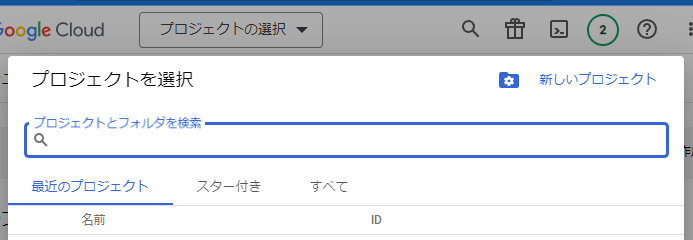

# WebアプリケーションからGoogleスプレッドシートへの書き込みサンプル(oAuth2認証, Express)
1. [目的と概要](#anchor1)
1. [Google APIを使用するための事前設定](#anchor2)
1. [利用モジュールのインストール](#anchor3)
1. [Express設定](#anchor4)
1. [Passport設定](#anchor5)
1. [Google OAuth2設定](#anchor6)
1. [Google API利用サンプル](#anchor7)
1. [画面作成(ログインボタン＋書き込み先スプレッドシートURL)](#anchor8)
1. [動作確認](#anchor9)
## 1:目的と概要 <a id="anchor1"></a>

OAuth2で認証後、Google APIを利用するサンプルです。

OAuth2で認証を行うと、スプレッドシートのアクセス権限に「リンクを知っている全員に変更」を与えられないような場合でも、アプリが「許可されている本人」になり替わって書き込みを行います。

  * 最初に(スプレッドシートに書き込みできる人で)、Googleへログインを行います
    * [Passport](https://www.passportjs.org/)と、ミドルウェア[Passport-google-oauth2](https://www.passportjs.org/packages/passport-google-oauth2/)を利用
    * ログイン時、「Webアプリがスプレッドシートへの書き込み」を許可するか？の確認があります
    * 許可すると「Webアプリ」はログインした人になり替わって、スプレッドシートに書き込みを行うことができるようになります
  * 画面で指定したスプレッドシートへデータを書き込みます

## 2:Google APIを使用するための事前設定 <a id="anchor2"></a>

認証情報を作成して「`クライアントID`」「`クライアントシークレット`」を取得します

1. Google Cloud Platformでプロジェクトを作成
1. プロジェクトで使用するAPIを有効化
1. APIへのアクセスに必要な認証情報を作成

### Google Cloud Platformでプロジェクトを作成

* [GCPダッシュボード](https://console.cloud.google.com/projectselector2/home/dashboard)へアクセスして、「`プロジェクトの選択`」をクリック ⇒ 「`新しいプロジェクト`」をクリックする


### プロジェクトで使用するAPIを有効化
* 適当な名前を付けてプロジェクトを作成する


* 左メニューから「APIとサポート」⇒「有効なAPIとサービス」を選択


* 「APIとサービスの有効化」をクリック


* 検索欄に「sheets」と入力して、検索結果(Google Sheets API)をクリック


* 「Google Sheets API」を有効にする


### APIへのアクセスに必要な認証情報を作成
#### OAuth同意画面の登録

* Google Workspace の組織外のユーザーを利用する場合は「外部」を選択


* OAuth同意画面を入力する
  * 適当なアプリ名を入力
  * ユーザーサポートメールと、デベロッパーの連絡先情報にメールアドレスを入力


* スコープの設定画面「スコープを追加または削除」をクリック
 

* フィルタに「sheet」と入力して検索を行い、範囲が「auth/spreadsheets」となっている行にチェックを入れて「更新」する


* 元の「スコープの設定画面」へ戻り、「保存して次へ」をクリック


* テストユーザーを追加（自分のメールアドレス）後、、「保存して次へ」をクリック


### 認証情報を作成する

* 「認証情報」をクリック。「認証情報を作成」⇒「OAuthクライアントID」をクリックする


* AuthクライアントIDの作成
  * アプリケーションの種類：ウェブアプリケーション
  * 名前：任意の名前
  * 承認済みのリダイレクトURI：http://localhost:3000/auth/google/callback


* OAuthクライアントID確認画面
  * 画面に表示されている「クライアントID」「クライアントシークレット」をメモっておきます（設定ファイル(.env)に記載）


参考ページ
[Google Spreadsheet をサービスアカウントに共有せずにGoogle Spreadsheet APIから読みだす方法](https://qiita.com/7032/items/50fc96b6e8c9ac90c32)

`.env`ファイルにクライアント情報をセットしておきます
```
APP_PORT=3000
GOOGLE_CLIENT_ID=`クライアントID`
GOOGLE_CLIENT_SECRET=`クライアントシークレット`
```

## 3:利用モジュールのインストール <a id="anchor3"></a>

  * 必要なモジュールをインストールします

```bash
npm init -y
npm i dotenv ejs express express-session passport passport-google-oauth googleapis
```

|  パッケージ  |  内容  |
| ---- | ---- |
|  dotenv  |  環境変数をファイルから読み込むためのツール  |
|  ejs  |  expressで利用するテンプレートエンジン  |
|  express  |  node.jsのウェブ用フレームワーク  |
|  express-session  |  セッションを管理するためのミドルウェア  |
|  passport  | 認証ミドルウェア  |
|  passport-google-oauth  |  Googleを使用して認証するためのストラテジー  |
|  googleapis  |  Google API クライアント  |

## 4:Express設定 <a id="anchor4"></a>
ルートフォルダに`index.js`ファイルを作成し、Expressでサーバーコードを記載します

* 認証情報の保持にセッションを利用するため`express-session`を読み込む

```js
// index.js
/* *******************************************************************
 * Express設定
 * ・passport.jsでuserを保持するためsessionを利用
 * ******************************************************************/
require('dotenv').config();
const express = require('express');
const app = express();
const session = require('express-session');

app.set('view engine', 'ejs');
// formからのデータ受け取り
app.use(express.urlencoded({ extended: true }));

app.use(
  session({
    resave: false,
    saveUninitialized: true,
    secret: 'SECRET',
  })
);

const port = process.env.APP_PORT || 3000;
app.listen(port, () => console.log('App listening on port ' + port));
```

## 5:Passport設定<a id="anchor5"></a>

ログアウト用の処理と、ログイン後のユーザー情報の保存・復元処理を記載します

```js
/* *******************************************************************
 * Passport設定
 * ・Strategyはpassport-google-oauthを利用
 * ******************************************************************/
const passport = require('passport');

app.use(passport.initialize());
app.use(passport.session());

// ログアウト
app.get('/logout', (req, res, next) => {
  req.logout((err) => {
    if (err) {
      return next(err);
    }
    res.redirect('/');
  });
});

app.get('/error', (req, res) => res.send('error logging in'));

// ユーザー情報をsessionに保存
passport.serializeUser((user, done) => {
  console.log(user);
  done(null, user);
});

// セッションからユーザー情報の復元(req.user)
passport.deserializeUser((obj, done) => {
  done(null, obj);
});
```
## 6:Google OAuth2設定 <a id="anchor6"></a>

Passportにストラテジー(GoogleのOAuth2)をセット
* 事前設定で取得した「`クライアントID`」と「`クライアントシークレット`」をセットします
* スプレッドシートを操作できるようにするため、事前設定で有効化した「https://www.googleapis.com/auth/spreadsheets 」を指定します

※.envファイル

```js
/* *******************************************************************
 * Google OAuth2 認証設定
 * ・Google Developer Consoleで認証情報を作成しておく
 *   参考URL https://qiita.com/7032/items/50fc96b6e8c9ac90c32f
 * ・作成した認証情報のclientIdと、clientSecretを環境変数にセットしておくこと
 * ******************************************************************/
const GoogleStrategy = require('passport-google-oauth').OAuth2Strategy;
const { GOOGLE_CLIENT_ID, GOOGLE_CLIENT_SECRET } = process.env;
passport.use(
  new GoogleStrategy(
    {
      clientID: GOOGLE_CLIENT_ID,
      clientSecret: GOOGLE_CLIENT_SECRET,
      callbackURL: `http://localhost:${port}/auth/google/callback`,
    },
    (accessToken, refreshToken, profile, done) => {
      // Verify Function (ユーザー存在チェック等を行う)
      //  問題がなければユーザー情報callbackに渡すことでreq.userに格納される
      return done(null, { ...profile, accessToken, refreshToken });
    }
  )
);

// 認証
// ・スプレッドシートを読み書きするためのscopeを指定
app.get(
  '/auth/google',
  passport.authenticate('google', {
    scope: ['profile', 'email', 'https://www.googleapis.com/auth/spreadsheets'],
    accessType: 'offline',
    prompt: 'consent',
  })
);

// 認証後のcallback
app.get(
  '/auth/google/callback',
  passport.authenticate('google', { failureRedirect: '/error' }),
  (req, res) => {
    // 認証成功時
    res.redirect('/');
  }
);
```

## 7:Google API (Sheets) 利用サンプル <a id="anchor7"></a>

コメントを参照
```js
/* *******************************************************************
 * Google API (Sheets) 利用サンプル
 * ・書き込み先スプレッドシート(URL)を入力する画面を表示する
 * ・OAuth2認証で取得したaccessToken, refreshTokenを使いSheetに書き込みを行う
 * ******************************************************************/
// メインページ(スプレッドシートURL、書き込みデータ入力画面)を表示(GET)
app.get('/', (req, res) =>
  res.render('pages/sheet', {
    error_message: '',
    sheetURL: '',
    insertValue: '',
    user: req.user,
  })
);

const { google } = require('googleapis');

// OAuth2Clientを初期化
const oAuth2Client = new google.auth.OAuth2({
  clientId: process.env.GOOGLE_CLIENT_ID,
  clientSecret: process.env.GOOGLE_CLIENT_SECRET,
});

// 指定されたスプレッドシートにデータを追記する(POST)
app.post('/', async (req, res) => {
  // フォーム入力値
  const { sheetURL, insertValue, redirectToSheet } = req.body;

  // スプレッドシートIDを抜き出す
  const match = sheetURL.match(/spreadsheets\/d\/([0-9a-zA-Z\-_]+)/);
  if (!match) {
    res.render('pages/sheet', {
      ...req.body,
      user: req.user,
      error_message: 'URLが無効です',
    });
    return;
  }
  const spreadsheetId = match[1];

  // ログイン時に取得したトークンをセット
  oAuth2Client.setCredentials({
    refresh_token: req.user.refreshToken,
    access_token: req.user.accessToken,
  });

  // API経由でスプレッドシートへ書き込み
  const sheets = google.sheets({ version: 'v4', auth: oAuth2Client });
  const param = {
    spreadsheetId: spreadsheetId,
    range: 'シート1!A1',
    valueInputOption: 'USER_ENTERED',
    insertDataOption: 'INSERT_ROWS', // 最後に追加
    resource: {
      values: [insertValue.split(',')],
    },
  };
  // スプレッドシートにデータを追加
  await sheets.spreadsheets.values.append(param);

  if (redirectToSheet == 'checked') {
    // リダイレクトを指定した場合、スプレッドシートを表示
    res.redirect(
      `https://docs.google.com/spreadsheets/d/${spreadsheetId}/edit#gid=0`
    );
  } else {
    res.render('pages/sheet', {
      ...req.body,
      user: req.user,
      error_message: '',
    });
  }
});
```
## 8:画面作成(ログインボタン＋書き込み先スプレッドシートURL) <a id="anchor8"></a>

* 未ログイン時、Googleのログインボタンを表示
* スプレッドシートのURLと書き込む内容を入力


```html
<!-- views/pages/sheet.ejs -->
<!doctype html>
<html>
<head>
    <title>Google API(oAuth2) sample</title>
    <link rel="stylesheet" href="https://stackpath.bootstrapcdn.com/bootstrap/4.4.1/css/bootstrap.min.css">
    <link rel="stylesheet" href="https://stackpath.bootstrapcdn.com/font-awesome/4.7.0/css/font-awesome.min.css">
</head>
<body>
<div class="container">
    <div class="jumbotron text-center text-primary pb-2 mt-5">
        <h1 class="display-5"><span class="fa fa-table"></span>Google API(oAuth2, sheets) sample</h1>
        <p class="lead">Googlenにログイン後、スプレッドシートにデータを追記するサンプル</p>
        <hr class="my-4">
        <p>
          ようこそ<%= user? user.displayName: 'ゲスト' %>さん
          <% if (user) { %>  （<a href="/logout">ログアウト</a>） <% } %></p>
    </div>
    <% if (!user) { %>
    <div class="border border-secondary rounded p-4 mb-2">
      <p class="lead">①スプレッドシートに書き込みできるユーザーでログインを行う</p>
      <a href="/auth/google" class="btn btn-danger"><span class="fa fa-google"></span> SignIn with Google</a>
    </div>
    <% } %>
    <form method="POST" id="frm" class="border border-secondary rounded p-4 ">
      <p class="lead">②スプレッドシートのURLと書き込む内容を入力して「書き込み」ボタンをクリック</p>

      <div class="form-group">
        <label for="sheetURL">書き込み先スプレッドシートのURL</label>
        <input class="form-control" type="text" id="sheetURL" name="sheetURL" placeholder="https://docs.google.com/spreadsheets/d/&lt;spread sheet id&gt;/edit#gid=0" value="<%= sheetURL %>" <%= !user? 'readonly': ''%>>
      </div>
      <div class="form-group">
        <label for="insertValue">追記するデータ(csv形式)</label>
        <input class="form-control" id="insertValue" name="insertValue"
        placeholder="Aセル,=row(),12" value="<%= insertValue %>" <%= !user? 'readonly': ''%>></input>
      </div>
      <div class="form-group form-check">
        <input type="checkbox" class="form-check-input" id="redirectToSheet"  name="redirectToSheet" value="checked" <%= !user? 'disabled': ''%>>
        <label class="form-check-label" for="redirectToSheet">書き込み後、スプレッドシートにリダイレクトする</label>
      </div>
      <div>
        <p class="text-warning"><%= error_message %></p>
        <input type="submit" class="btn btn-primary" value="書き込み" <%= !user? 'disabled': ''%>></input>
        <span class="text-secondary align-bottom"></span>
      </div>
    </form>
</div>
</body>
</html>

```
## 9:動作確認 <a id="anchor9"></a>

* ログインボタンをクリック


* アカウント情報(メールアドレス、パスワード)を入力（ログイン済みの場合は、アカウントを選択）


* テスト用の状態でアプリ登録しているため確認画面が表示される（続行をクリック）


* アクセス権(スプレッドシートの編集)が与えられていることを確認して「続行」をクリック


* 元の画面(入力可能)へ戻るので、スプレッドシートのURLと、書き込みたい内容を記載して「書き込み」をクリック


* スプレッドシートへデータが書き込みできたことを確認


## 10:参考ページ <a id="anchor10"></a>

* [Google OAuth2 Authentication in NodeJS](https://www.loginradius.com/blog/engineering/google-authentication-with-nodejs-and-passportjs/)

* [Google Spreadsheet をサービスアカウントに共有せずにGoogle Spreadsheet APIから読みだす方法](https://qiita.com/7032/items/50fc96b6e8c9ac90c32f)

* [スプレッドシート API で行を追加する](https://qiita.com/castaneai/items/a53d0b89bca5b84654be)
